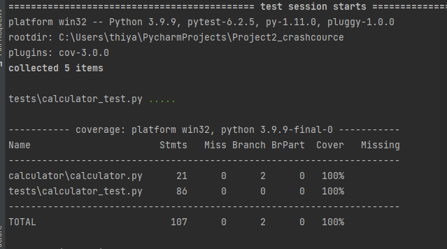
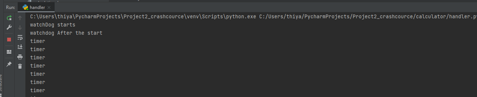
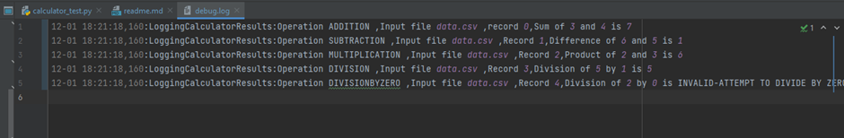

### Assignment-5 CSV File Handling ,Design your own code

 

Also you can click below to view the build for this assignment  

[build for assignmnet 1](https://app.travis-ci.com/github/njitvjk/calc2/builds/241320285)

#### Operations
Addition 
Subtraction 
Mulitplication 
Divison with exception for Division by zero

### Tasks
1.Watchdog implementation to move file from input to done folder 
2.pandas dataframe has been implemented for Arithematic operations 
3.Logging mechanism at level INFO has been implemented to capture log result and exceptions  
    a.timestamp 
    b.Input file name  
    c.Operation 
    d.Record 
    e.Input values  
    c.Result or Exception 

#### Files for this assignment to review code
1.calculator/main.py- Watchdog 
2.calculator/calculator.py-Contains all arithematic operations 
3.tests/calculator_test.py- Pandas dataframe 

#### Build Screen shot  

#### output

#### Screenshots
Watchdog

logfile

